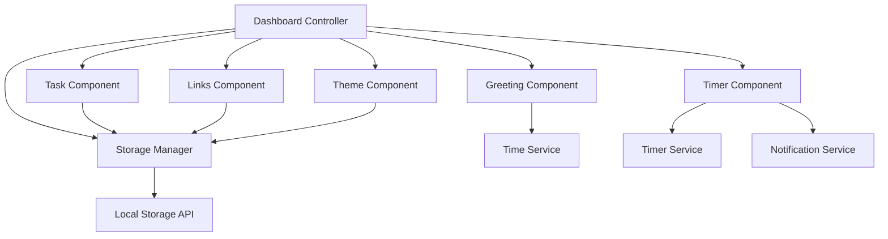

# Design Document: Productivity Dashboard

## Overview

The Productivity Dashboard is a client-side web application built with vanilla HTML, CSS, and JavaScript that provides essential productivity tools in a single, clean interface. The application operates entirely in the browser using Local Storage for data persistence, requiring no backend infrastructure.

The dashboard integrates four core productivity components:
- **Time Display & Greeting**: Dynamic time-based welcome messages
- **Pomodoro Focus Timer**: 25/5/15 minute work/break cycles with audio notifications
- **Task Management**: Full CRUD operations for to-do list management
- **Quick Links**: Favorite website shortcuts for rapid navigation
- **Theme System**: Light/dark mode toggle with preference persistence

The design prioritizes simplicity, performance, and reliability while maintaining modern web standards and cross-browser compatibility.

## Architecture

### System Architecture

The application follows a modular component-based architecture with clear separation of concerns:



### Component Hierarchy

- **Dashboard Controller**: Main application orchestrator
  - **Greeting Component**: Time display and personalized greetings
  - **Timer Component**: Pomodoro timer with session management
  - **Task Component**: Task CRUD operations and display
  - **Links Component**: Quick links management
  - **Theme Component**: Light/dark mode controller
- **Storage Manager**: Centralized data persistence layer
- **Service Layer**: Utility services for time, timers, and notifications

### Technology Stack

- **Frontend**: HTML5, CSS3, Vanilla JavaScript (ES6+)
- **Storage**: Browser Local Storage API
- **Styling**: CSS Custom Properties for theming
- **Notifications**: Web Notifications API (with fallback)
- **Build**: No build process - direct browser execution

## Components and Interfaces

### Dashboard Controller

**Purpose**: Main application entry point and component orchestrator

**Interface**:
```javascript
class DashboardController {
  constructor()
  init()
  handleStorageError(error)
  handleComponentError(component, error)
}
```

**Responsibilities**:
- Initialize all components
- Handle global error states
- Coordinate inter-component communication
- Manage application lifecycle

### Greeting Component

**Purpose**: Display current time, date, and time-based greeting

**Interface**:
```javascript
class GreetingComponent {
  constructor(container)
  init()
  updateTime()
  getGreeting(hour)
  render()
}
```

**DOM Structure**:
```html
<div class="greeting-container">
  <div class="greeting-text">Good morning</div>
  <div class="current-time">10:30 AM</div>
  <div class="current-date">Monday, March 15, 2024</div>
</div>
```

### Timer Component

**Purpose**: Pomodoro timer with focus/break session management

**Interface**:
```javascript
class TimerComponent {
  constructor(container, notificationService)
  init()
  start()
  stop()
  reset()
  switchSession(type)
  updateDisplay()
  handleTimerComplete()
}
```

**State Management**:
- Current session type (focus/short-break/long-break)
- Remaining time in seconds
- Session count for long break calculation
- Timer running state

**DOM Structure**:
```html
<div class="timer-container">
  <div class="session-type">Focus Session</div>
  <div class="timer-display">25:00</div>
  <div class="timer-controls">
    <button class="start-btn">Start</button>
    <button class="stop-btn">Stop</button>
    <button class="reset-btn">Reset</button>
  </div>
  <div class="session-progress">Session 1 of 4</div>
</div>
```

### Task Component

**Purpose**: Task management with full CRUD operations

**Interface**:
```javascript
class TaskComponent {
  constructor(container, storageManager)
  init()
  addTask(text)
  editTask(id, newText)
  toggleTask(id)
  deleteTask(id)
  reorderTasks(fromIndex, toIndex)
  render()
}
```

**Task Data Model**:
```javascript
{
  id: string,
  text: string,
  completed: boolean,
  createdAt: timestamp,
  order: number
}
```

**DOM Structure**:
```html
<div class="task-container">
  <div class="task-input-section">
    <input type="text" class="task-input" placeholder="Add a new task...">
    <button class="add-task-btn">Add</button>
  </div>
  <div class="task-list">
    <div class="task-item" data-task-id="123">
      <input type="checkbox" class="task-checkbox">
      <span class="task-text">Sample task</span>
      <button class="edit-task-btn">Edit</button>
      <button class="delete-task-btn">Delete</button>
    </div>
  </div>
</div>
```

### Links Component

**Purpose**: Quick links management for favorite websites

**Interface**:
```javascript
class LinksComponent {
  constructor(container, storageManager)
  init()
  addLink(name, url)
  editLink(id, name, url)
  deleteLink(id)
  validateUrl(url)
  render()
}
```

**Link Data Model**:
```javascript
{
  id: string,
  name: string,
  url: string,
  createdAt: timestamp
}
```

**DOM Structure**:
```html
<div class="links-container">
  <div class="links-input-section">
    <input type="text" class="link-name-input" placeholder="Link name">
    <input type="url" class="link-url-input" placeholder="https://example.com">
    <button class="add-link-btn">Add</button>
  </div>
  <div class="links-grid">
    <a href="https://example.com" target="_blank" class="link-item">
      <span class="link-name">Example Site</span>
    </a>
  </div>
</div>
```

### Theme Component

**Purpose**: Light/dark theme management with persistence

**Interface**:
```javascript
class ThemeComponent {
  constructor(storageManager)
  init()
  toggleTheme()
  setTheme(theme)
  applyTheme(theme)
}
```

**CSS Custom Properties**:
```css
:root {
  --bg-primary: #ffffff;
  --bg-secondary: #f8f9fa;
  --text-primary: #212529;
  --text-secondary: #6c757d;
  --border-color: #dee2e6;
  --accent-color: #007bff;
}

[data-theme="dark"] {
  --bg-primary: #212529;
  --bg-secondary: #343a40;
  --text-primary: #f8f9fa;
  --text-secondary: #adb5bd;
  --border-color: #495057;
  --accent-color: #0d6efd;
}
```

### Storage Manager

**Purpose**: Centralized data persistence using Local Storage

**Interface**:
```javascript
class StorageManager {
  constructor()
  save(key, data)
  load(key)
  remove(key)
  clear()
  isAvailable()
  handleQuotaExceeded()
}
```

**Storage Keys**:
- `dashboard_tasks`: Task list data
- `dashboard_links`: Quick links data
- `dashboard_theme`: Theme preference
- `dashboard_timer_state`: Timer session state

## Data Models

### Task Model
```javascript
{
  id: string,           // UUID for unique identification
  text: string,         // Task description (max 500 chars)
  completed: boolean,   // Completion status
  createdAt: number,    // Unix timestamp
  order: number         // Display order for sorting
}
```

### Link Model
```javascript
{
  id: string,           // UUID for unique identification
  name: string,         // Display name (max 100 chars)
  url: string,          // Valid URL with protocol
  createdAt: number     // Unix timestamp
}
```

### Timer State Model
```javascript
{
  sessionType: string,  // 'focus' | 'short-break' | 'long-break'
  remainingTime: number, // Seconds remaining
  sessionCount: number,  // Completed focus sessions
  isRunning: boolean,    // Timer active state
  lastUpdated: number    // Unix timestamp
}
```

### Theme Model
```javascript
{
  current: string,      // 'light' | 'dark'
  preference: string    // User's saved preference
}
```

### Application State Model
```javascript
{
  tasks: Task[],
  links: Link[],
  timerState: TimerState,
  theme: Theme,
  lastSync: number      // Last storage sync timestamp
}
```

**Data Validation Rules**:
- Task text: 1-500 characters, no HTML
- Link name: 1-100 characters, no HTML
- Link URL: Valid HTTP/HTTPS URL format
- All IDs: UUID v4 format
- Timestamps: Valid Unix timestamps
- Session types: Enum validation
- Theme values: Enum validation

**Storage Constraints**:
- Maximum 100 tasks (performance requirement)
- Maximum 50 links (performance requirement)
- Total storage under 5MB Local Storage limit
- Graceful degradation when storage unavailable

## Correctness Properties

*A property is a characteristic or behavior that should hold true across all valid executions of a system-essentially, a formal statement about what the system should do. Properties serve as the bridge between human-readable specifications and machine-verifiable correctness guarantees.*

### Property 1: Time Display Accuracy

*For any* current time, the dashboard should display the correct date in readable format and update the time display to match the current time.

**Validates: Requirements 1.1, 1.2**

### Property 2: Greeting Time Range Correctness

*For any* time of day, the greeting should be "Good morning" for 5:00 AM - 11:59 AM, "Good afternoon" for 12:00 PM - 5:59 PM, and "Good evening" for 6:00 PM - 4:59 AM.

**Validates: Requirements 1.3, 1.4, 1.5**

### Property 3: Timer Session Duration Correctness

*For any* session type, the timer should initialize with the correct duration: 25 minutes for focus sessions, 5 minutes for short breaks, and 15 minutes for long breaks.

**Validates: Requirements 2.1, 2.2, 2.3**

### Property 4: Timer Session Transition Logic

*For any* completed focus session, if fewer than 4 focus sessions have been completed, the next session should be a short break; if 4 focus sessions have been completed, the next session should be a long break.

**Validates: Requirements 2.4, 2.5**

### Property 5: Timer Control Operations

*For any* timer state, the start, stop, and reset controls should correctly modify the timer state and the timer should display the current session type and remaining time.

**Validates: Requirements 2.6, 2.8**

### Property 6: Timer Completion Notification

*For any* timer that reaches zero, a notification should be triggered to alert the user.

**Validates: Requirements 2.7**

### Property 7: Task CRUD Operations

*For any* task list and valid task data, adding a task should increase the list length by one, editing should update the task text, toggling should change completion status, deleting should remove the task, and reordering should change task positions correctly.

**Validates: Requirements 3.1, 3.2, 3.3, 3.4, 3.5**

### Property 8: Task Persistence Round Trip

*For any* set of tasks, saving to Local Storage and then loading should restore the exact same task data with all properties intact.

**Validates: Requirements 3.6, 3.7**

### Property 9: Task Visual State Distinction

*For any* task, completed tasks should have visually different properties than pending tasks in the rendered output.

**Validates: Requirements 3.8**

### Property 10: Link CRUD Operations

*For any* link list and valid link data, adding a link should increase the list length by one, editing should update the link properties, and deleting should remove the link from the list.

**Validates: Requirements 4.1, 4.2, 4.3**

### Property 11: Link Navigation Behavior

*For any* link in the quick links list, clicking should trigger navigation to the correct URL in a new tab.

**Validates: Requirements 4.4**

### Property 12: Link Persistence Round Trip

*For any* set of links, saving to Local Storage and then loading should restore the exact same link data with all properties intact.

**Validates: Requirements 4.5, 4.6**

### Property 13: URL Validation

*For any* URL string, the validation function should accept valid HTTP/HTTPS URLs and reject invalid URL formats.

**Validates: Requirements 4.7**

### Property 14: Theme Toggle Functionality

*For any* current theme state, toggling should switch to the opposite theme (light to dark or dark to light).

**Validates: Requirements 5.1**

### Property 15: Theme Visual Implementation

*For any* theme setting, light mode should apply light background with dark text properties, and dark mode should apply dark background with light text properties to all interface elements.

**Validates: Requirements 5.2, 5.3, 5.4**

### Property 16: Theme Persistence Round Trip

*For any* theme preference, saving to Local Storage and then loading should restore the same theme setting, with light mode as default when no preference exists.

**Validates: Requirements 5.5, 5.6, 5.7**

### Property 17: Local Storage Data Persistence

*For any* application data change, the data should be immediately saved to Local Storage and correctly restored when the application loads.

**Validates: Requirements 6.1, 6.2, 6.3**

### Property 18: Storage Error Handling

*For any* Local Storage unavailability or quota exceeded condition, the application should handle the error gracefully and display appropriate warning messages without crashing.

**Validates: Requirements 6.4, 6.5**

### Property 19: High Volume Data Handling

*For any* task list with up to 100 tasks or link list with up to 50 links, all CRUD operations should continue to function correctly.

**Validates: Requirements 8.4, 8.5**

### Property 20: Interactive Element Feedback

*For any* interactive element in the dashboard, the element should provide appropriate visual feedback states (hover, active, disabled) when interacted with.

**Validates: Requirements 9.3**

### Property 21: Responsive Layout Functionality

*For any* desktop screen size within the supported range, the dashboard layout should remain functional and all components should be accessible.

**Validates: Requirements 9.6**

## Error Handling

### Error Categories and Strategies

**Storage Errors**:
- Local Storage unavailable: Display warning banner, continue with in-memory operation
- Quota exceeded: Attempt cleanup of old data, notify user, graceful degradation
- Data corruption: Reset to defaults, log error, notify user of data loss

**Timer Errors**:
- Notification permission denied: Fall back to visual notifications
- Timer drift: Recalibrate against system time periodically
- Invalid session state: Reset to default focus session

**Data Validation Errors**:
- Invalid task text: Sanitize input, reject empty/oversized content
- Invalid URL format: Show validation message, prevent saving
- Malformed stored data: Reset to defaults, preserve what's recoverable

**Component Errors**:
- Component initialization failure: Show error message, disable component
- DOM manipulation errors: Log error, attempt recovery, graceful degradation
- Event handler errors: Log error, prevent propagation, maintain app stability

### Error Recovery Mechanisms

**Automatic Recovery**:
- Periodic data validation and cleanup
- Timer state reconciliation on page load
- Storage quota monitoring and management

**User-Initiated Recovery**:
- Manual data reset options in settings
- Export/import functionality for data backup
- Clear storage option for troubleshooting

**Graceful Degradation**:
- Continue operation without storage when unavailable
- Visual notifications when audio notifications fail
- Basic functionality when advanced features fail

## Testing Strategy

### Dual Testing Approach

The testing strategy employs both unit testing and property-based testing to ensure comprehensive coverage:

**Unit Tests**: Focus on specific examples, edge cases, and integration points
- Component initialization and lifecycle
- Error condition handling
- Browser API integration points
- User interaction scenarios
- Data validation edge cases

**Property Tests**: Verify universal properties across all inputs using randomized testing
- CRUD operations with generated data
- Time-based logic with random timestamps
- Storage round-trip operations
- Theme switching with various states
- Data validation with random inputs

### Property-Based Testing Configuration

**Testing Library**: fast-check (JavaScript property-based testing library)

**Test Configuration**:
- Minimum 100 iterations per property test
- Custom generators for domain-specific data (tasks, links, timestamps)
- Shrinking enabled for minimal failing examples
- Timeout protection for long-running properties

**Property Test Tags**: Each property test must include a comment referencing the design document property:
```javascript
// Feature: productivity-dashboard, Property 7: Task CRUD Operations
```

### Test Organization

**Unit Test Structure**:
```
tests/
├── unit/
│   ├── components/
│   │   ├── greeting.test.js
│   │   ├── timer.test.js
│   │   ├── tasks.test.js
│   │   ├── links.test.js
│   │   └── theme.test.js
│   ├── services/
│   │   ├── storage.test.js
│   │   ├── notifications.test.js
│   │   └── time.test.js
│   └── integration/
│       └── dashboard.test.js
└── properties/
    ├── greeting.properties.js
    ├── timer.properties.js
    ├── tasks.properties.js
    ├── links.properties.js
    ├── theme.properties.js
    └── storage.properties.js
```

**Test Data Management**:
- Mock Local Storage for consistent testing
- Time mocking for deterministic time-based tests
- DOM testing utilities for component interaction
- Custom matchers for domain-specific assertions

### Coverage Requirements

**Code Coverage**: Minimum 90% line coverage for all components
**Property Coverage**: Each correctness property must have corresponding property test
**Browser Testing**: Automated testing in target browser versions
**Performance Testing**: Load testing with maximum data volumes (100 tasks, 50 links)